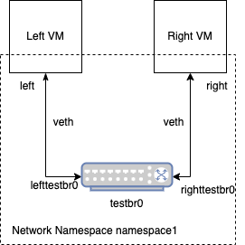

# Introduction

This is a demonstration of how to control networking between VMs on the same host with SELinux.

The basic challenge is that inter-VM networking on the same host has some complicated interactions with the network stack, leading to the SELinux network controls working differently than they would for, say, normal process interacting over localhost. You can read more about the details of that in this mailing-list exchange: https://lore.kernel.org/all/CA+EEuAgfGhTWBWXgtHSVU22feM+0PS=h-z-eVF4JxmSf2qyZzg@mail.gmail.com/.

This repo contains an example of using a combination of Netlabel and Secmark to achieve control over how packets flow through the system. It is important to note, however, that this is very dependent on how the networking is configured.

The basic idea is that the VM host - the system running KVM - is routing packets between the virtual machines. Just as if instead of virtual machines running on the host it was a router between real physical servers. That means that the networking works the same way. It also means that the packet { send recv } controls are not the controls that we will be using (which only work for normal processes). Instead, we will using the packet { forward_in forward_out } permissions combined with netif { ingress egress }.

# Networking Overview

First, the network setup should be as follows:



The `virtual-networking.sh` script will create this setup for you. Some notes on this setup:

1. It's comprised of a virtual bridge and two veth pairs. Virtual bridges are just software bridges (think a switch or hub) and veth pairs are like network cables. So this is really just connecting the two VMs through a software switch using two cables.

2. Veth pairs - while acting like a cable - have a name for each end. That allows them to be "plugged" in appropriately by referring to the name for the end that is meant.

3. The key to this whole setup is forcing the traffic to flow through the bridge and be switched. This allows the host kernel to "see" the traffic - that is for the traffic to flow through the appropriate netfilter hooks. Those hooks are what allows iptables to do its work and, consequently, allow the SELinux enforcement to happen. It's possible to connect the VMs directly with a veth pair. In that case, no enforcement is possible because the raw ethernet frames are just copied between the VMs and no netfilter hooks are called.

# Labeling

Labeling will be done in two different ways: netlabel fallback and secmark. The labeling is used for difference purposes and does different things.

## Netlabel Fallback

Netlabel is, typically, used to convey process labels across the network (using IP extensions - it's called CIPSO or CALIPSO). In a typical netlabel deployment, however, you can set a "fallback" label, that is a label that is applied to a packet when it arrives otherwise unlabled. That is the mechanism that we will use here to apply labels to the packets originating from the VMs.

The basic concept is that we will apply packet labels using netlabel fallback, which will then let enforcement happen based upon those packet labels. To do so, you run netlabel commands such as the following:

```
netlabelctl unlbl add interface:testbr0 address:192.168.6.0/24 label:system_u:object_r:right_vm_t:s0

netlabelctl unlbl add interface:testbr0 address:10.0.0.0/24 label:system_u:object_r:left_vm_t:s0
```


1. `sudo semodule -i module.cil`
2. `sudo ./virtual-networking.sh`
3. `sudo ./iptables.sh`
4. `sudo ./cipso.sh`

In virt-manager, my config looks like this, which you need to edit the networking xml directly.

`<interface type="direct">`  
  `<mac address="52:54:00:2f:0a:40"/>`  
  `<source dev="left" mode="passthrough"/>`  
  `<target dev="macvtap0"/>`  
  `<model type="virtio"/>`  
  `<alias name="net0"/>`  
  `<address type="pci" domain="0x0000" bus="0x01" slot="0x00" function="0x0"/>`  
`</interface>`  

This will generate denials like the following:

```
#============= left_vm_t ==============
allow left_vm_t bare_netif_t:netif ingress;
allow left_vm_t left_packet_t:packet forward_in;
allow left_vm_t node_t:node recvfrom;

#============= right_vm_t ==============
allow right_vm_t bare_netif_t:netif ingress;
allow right_vm_t node_t:node recvfrom;
allow right_vm_t right_packet_t:packet forward_in;
```
