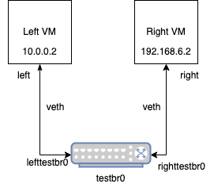

# Introduction

This is a demonstration of how to control networking between VMs on the same host with SELinux.

The basic challenge is that inter-VM networking on the same host has some complicated interactions with the network stack, leading to the SELinux network controls working differently than they would for, say, normal process interacting over localhost. You can read more about the details of that in this mailing-list exchange: https://lore.kernel.org/all/CA+EEuAgfGhTWBWXgtHSVU22feM+0PS=h-z-eVF4JxmSf2qyZzg@mail.gmail.com/.

This repo contains an example of using a combination of Netlabel and Secmark to achieve control over how packets flow through the system. It is important to note, however, that this is very dependent on how the networking is configured.

The basic idea is that the VM host - the system running KVM - is routing packets between the virtual machines. Just as if instead of virtual machines running on the host it was a router between real physical servers. That means that the networking works the same way. It also means that the packet { send recv } controls are not the controls that we will be using (which only work for normal processes). Instead, we will using the packet { forward_in forward_out } permissions combined with netif { ingress egress }.

# Networking Overview

First, the network setup should be as follows:



The `virtual-networking.sh` script will create this setup for you. Some notes on this setup:

1. It's comprised of a virtual bridge and two veth pairs. Virtual bridges are just software bridges (think a switch or hub) and veth pairs are like network cables. So this is really just connecting the two VMs through a software switch using two cables.

2. Veth pairs - while acting like a cable - have a name for each end. That allows them to be "plugged" in appropriately by referring to the name for the end that is meant.

3. The key to this whole setup is forcing the traffic to flow through the bridge and be switched. This allows the host kernel to "see" the traffic - that is for the traffic to flow through the appropriate netfilter hooks. Those hooks are what allows iptables to do its work and, consequently, allow the SELinux enforcement to happen. It's possible to connect the VMs directly with a veth pair. In that case, no enforcement is possible because the raw ethernet frames are just copied between the VMs and no netfilter hooks are called.

The virtual machines are configured as follows:


With the networking for one of the VMs as follows (the other is the same connected to the other veth pair):


# Labeling

Labeling will be done in three different ways: netlabel fallback, secmark, and semanage interface labeling. The labeling is used for difference purposes and does different things. The netlabel labels are setting the peer - or process  - label, the secmark labels are setting the packet - or object - label, and semanage is setting the interface label.

Once we have done all of this, we will get denials that look like this:

```
allow right_vm_t right_packet_t:packet { forward_in forward_out }; 
allow right_vm_t testbr_netif_t:netif { egress ingress };
```

In this example, the process label `right_vm_t` is coming from netlabel, the packet label `right_packet_t` is coming from secmark, and the netif label `testbr_netif_t` is coming from semanage. You need all three mechanisms to make this happen, and then you can write rules to control packet forwarding.

## Netlabel Fallback

Netlabel is, typically, used to convey process labels across the network (using IP extensions - it's called CIPSO or CALIPSO). In a typical netlabel deployment, however, you can set a "fallback" label, that is a label that is applied to a packet when it arrives otherwise unlabeled. That is the mechanism that we will use here to apply labels to the packets originating from the VMs. It is, perhaps, unfortunate that these packets are unlabeled. In some sense they originate from the KVM process - which has a process label known to the kernel - but in another sense they are arriving from the virtualized system _inside_ of the KVM process and it makes sense that the packets are unlabeled. Regardless of whether we _want_ them to be unlabeled or not, they are unlabeled. So we have to deal with that.

The basic concept is that we will apply packet labels using netlabel fallback, which will then let enforcement happen based upon those packet labels. To do so, you run netlabel commands such as the following:

```
netlabelctl unlbl add interface:testbr0 address:192.168.6.0/24 label:system_u:object_r:right_vm_t:s0

netlabelctl unlbl add interface:testbr0 address:10.0.0.0/24 label:system_u:object_r:left_vm_t:s0
```

Note that this is labeling based upon IP address. In testing so far, it has not been possible to label based upon interface (such as the veth pair or macvtap interface). This has _serious_ consequences, because now it matters what the configuration is inside of the virtual machine. It is recommended that additional iptables network enforcement be done on the host to prevent VMs from sending unexpected traffic that would result in a VM sending traffic that would ultimately be labeled incorrectly.

See `cipso.sh` for details on this process.

## IPTables

IPTables uses secmark to perform packet labeling. This is much more typical SELinux network labeling. Here we can use rules such as the following:

```
iptables -t mangle -A PREROUTING -m physdev --physdev-in right+ -j SECMARK --selctx system_u:object_r:right_packet_t:s0

iptables -t mangle -A PREROUTING -m physdev --physdev-in left+ -j SECMARK --selctx system_u:object_r:left_packet_t:s0
```

These rules are matching on physical interface (in this case, one end of the veth pair such as righttestbr0 - it's using substring matching just to make the rules more flexible). These rules mark the packets as they enter the virtual bridge with the correct packet labels.

If you apply only the iptables rules, the denials would be as follows (missing the peer label):

```
#============= unlabeled_t ==============
allow unlabeled_t left_packet_t:packet { forward_in forward_out };
allow unlabeled_t right_packet_t:packet { forward_in forward_out };
```

See `iptables.sh` for more details (and note that there are more rules needed to functionally make traffic flow).

## SEManage

Semanage is very simple - it is just used to set the label on the network interface with a command such as:

```
semanage interface -a testbr0 -t testbr_netif_t
```

## SELinux Policy

The file `module.cil` has a small amout of policy just to define the needed types. It does not allow anything - we are just showing the correct denials being generated.

# Running The Example

This was all tested on a RHEL 8 host with Fedora virtual machines. The basic process is as follows:

1. `sudo semodule -i module.cil`
2. `sudo ./semanage.sh`
3. `sudo ./virtual-networking.sh`
4. `sudo ./iptables.sh`
4. `sudo ./cipso.sh`

Then start the virtual machines and generate traffic. I use `curl` in one VM and `python -m http.server` in the other.

This will generate denials like the following:

```
#============= right_vm_t ==============
allow right_vm_t node_t:node { recvfrom sendto };
allow right_vm_t right_packet_t:packet { forward_in forward_out };
allow right_vm_t testbr_netif_t:netif { egress ingress };
```
